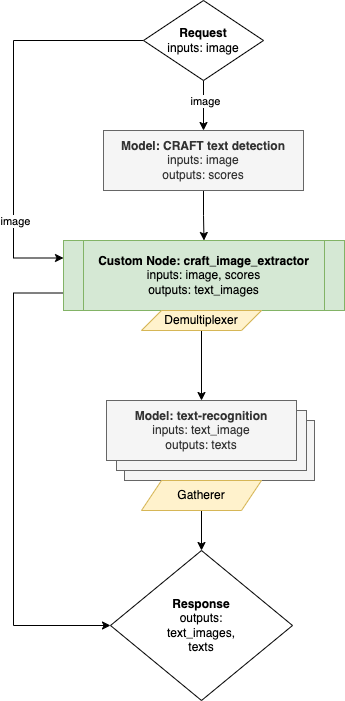

#  CRAFT Text Detection with Directed Acyclic Graph {#ovms_demo_craft_ocr}

This document demonstrates how to create and use a text detection pipeline based on the
[CRAFT](https://github.com/clovaai/CRAFT-pytorch) text detection model, combined with a custom node implementation to extract subimages of detected text, for further processing by a text recognition model.

## OCR Graph

Below is depicted the graph implementing the text detection pipeline:




It includes the following nodes:

- Model **CRAFT** - inference execution which takes the user image as input. It
  returns one outputs that combines two score maps: a text score map and a
  character link score map. 
- Custom node craft_ocr - it includes the C++ implementation of CRAFT model
  results post-processing. It analyses the score maps based on the configurable
  text and link score level thresholds and predicts text regions (bounding
  boxes) based on these score maps. 
- Finally the custom node craft_ocr crops all detected boxes
  from the original image, resize them to the target resolution and combines
  into a single output of a dynamic batch size. The output batch size is
  determined by the number of detected boxes according to the configured
  criteria. All operations on the images employ OpenCV libraries which are
  preinstalled in the OVMS. Learn more about the [craft_ocr custom
  node](/src/custom_nodes/craft_ocr)
- Response - the output of the whole pipeline is the recognized `image_texts`.

## Preparing the Models

### CRAFT model

The original pretrained model for CRAFT topology is stored [here](https://drive.google.com/open?id=1Jk4eGD7crsqCCg9C9VjCLkMN3ze8kutZ) in Pytorch format, as instructed in the [CRAFT README](https://github.com/clovaai/CRAFT-pytorch/blob/master/README.md).

Clone our fork of the CRAFT GitHub repository:

```bash
git clone https://github.com/ngaloppo/CRAFT-pytorch
cd CRAFT-pytorch
git checkout openvino
```

Download the file `craft_mlt_25k.pth` as instructed above. Then, export to
OpenVINO format with the provided export script:

```bash
pip -m venv craft
source craft/bin/activate
pip install -r requirements.txt
python export.py craft_mlt_25k.pth
```
This will create two files called `craft.xml` and `craft.bin` in the same folder. 

Converted CRAFT model will have the following interface:
- Input name: `input_images` ; shape: `[1 3 ? ?]` ; precision: `FP32` ; layout: `NCHW`
- Output name: `297` ; shape: `[1 ? ? 2]` ; precision: `FP32` ; layout: `N...`


## Building the Custom Node "craft_ocr" Library 

Custom nodes are loaded into OVMS as dynamic library implementing OVMS API from [custom_node_interface.h](https://github.com/openvinotoolkit/model_server/blob/releases/2022/1/src/custom_node_interface.h).
It can use OpenCV libraries included in OVMS or it could use other thirdparty components.

The custom node `craft_ocr` can be built inside a docker container via the following procedure:
- go to the directory with custom node examples [src/custom_nodes](../../../src/custom_nodes/). The implementation is in [src/custom_nodes/craft_ocr](../../../src/custom_nodes/craft_ocr/).
- run `make` command:

```bash
git clone https://github.com/ngaloppo/model_server.git
cd model_server/src/custom_nodes
git checkout craft
# replace to 'redhat` if using UBI base image
export BASE_OS=ubuntu
make NODES=craft_ocr BASE_OS=${BASE_OS}
cd ../../../
```

This command will export the compiled library in `./lib` folder.

Create a folder called `OCR`, and place the model files and custom node library in a folder structure with the following commands:

```bash
mkdir -p OCR/craft_fp32/1 OCR/lib
cp -R model_server/src/custom_nodes/lib/${BASE_OS}/libcustom_node_craft_ocr.so OCR/lib/
cp CRAFT-pytorch/craft.xml CRAFT-pytorch/craft.bin OCR/craft_fp32/1
```

## OVMS Configuration File

The configuration file for running the OCR demo is stored in [config.json](config.json)
Copy this file along with the model files and the custom node library like presented below:
```bash
cp model_server/demos/craft_ocr/python/config.json OCR
```
```bash
OCR
├── config.json
├── craft_fp32
│   └── 1
│       ├── craft.bin
│       └── craft.xml
├── lib
    └── libcustom_node_craft_ocr.so
```

## Deploying OVMS

Deploy OVMS with OCR demo pipeline using the following command:

```bash
docker run -p 9000:9000 -d -v ${PWD}/OCR:/OCR openvino/model_server --config_path /OCR/config.json --port 9000
```

## Requesting the Service

Change to the `demos/craft_ocr/python` directory
```bash
cd model_server/demos/craft_ocr/python
```

Install python dependencies:
```bash
pip3 install -r requirements.txt
``` 

Now you can create a directory for text images and run the client:

```bash
mkdir results

python3 craft_ocr.py --grpc_port 9000 --image_input_path demo_images/input.jpg --pipeline_name detect_text_images --text_images_output_name text_images --text_images_save_path ./results/ --image_layout NCHW --image_size 768

Image shape: (768, 768, 3)
Output: name[text_images]
    numpy => shape[(9, 1, 1, 32, 128)] data[float32]
```

With additional parameter `--text_images_save_path` the client script saves all detected text images to jpeg files into directory path to confirm if the image was analyzed correctly.

Below is the exemplary input image.


The custom node generates the following text images retrieved from the original input to CRNN model:


We can also benchmark if needed using `rp_craft_ocr.py`:

```bash
mkdir results

python3 rp_craft_ocr.py --grpc_port 9000 --image_input_path demo_images/input.jpg --pipeline_name detect_text_images --text_images_output_name text_images --text_images_save_path ./results/ --image_layout NCHW --image_size 768 --bench_time 20

Starting benchmarking for 20 sec...
Output: name[text_images]
    numpy => shape[(9, 1, 1, 32, 128)] data[float32]
Num iterations: 95
Avg Preprocessing Time: 0.0405 sec
Avg Latency: 0.1703 sec, p99: 0.2377 sec, p95: 0.1868 sec, FPS: 5.87
Post processing time: 0.0038 sec
```
